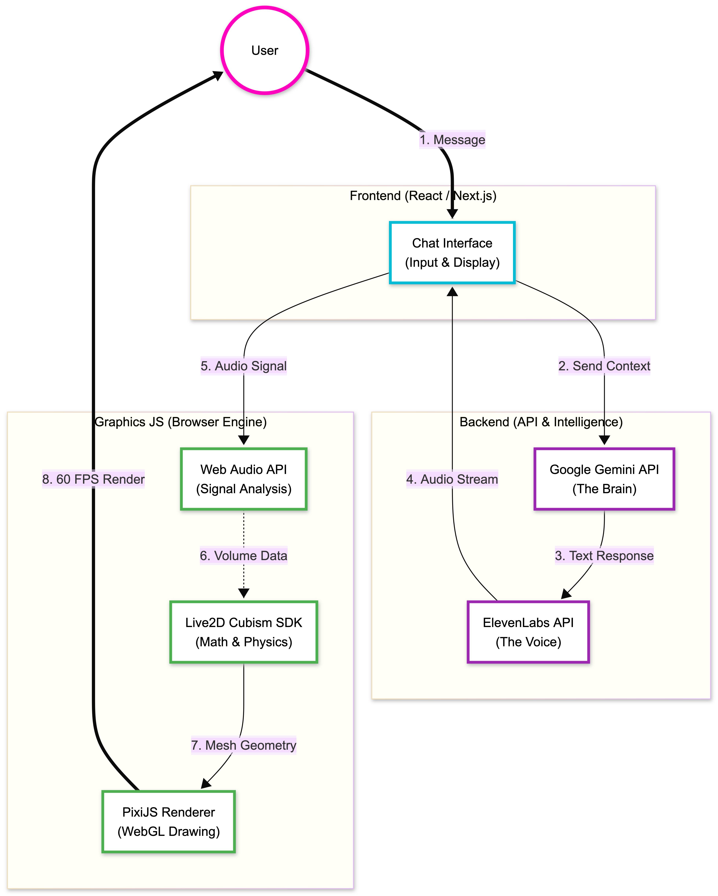

# AniFriend 💕

A web-based dating simulator featuring an interactive Live2D character that converses using AI-generated dialogue (Gemini API) and realistic voice synthesis (ElevenLabs API) with real-time lip synchronization.

## Features

- **Interactive Character Model** - High-fidelity 2D characters running on the **Cubism SDK** math & physics engine, rendered via **PixiJS** (WebGL).
- **AI Conversation** - Context-aware roleplay dialogue powered by **Google's Gemini API**.
- **Realistic Voice Synthesis** - Dynamic Text-to-Speech (TTS) generated by **ElevenLabs**.
- **Real-Time Lip Sync** - Mouth movements synchronized to audio volume using the browser's Web Audio API.
- **Dynamic Expressions** - Emotional states (Happy, Angry, Shy) triggered automatically by AI sentiment analysis.
- **Modern UI** - Responsive chat interface built with Next.js and Tailwind CSS.

## Browser Compatibility

- Chrome/Edge: ✅ Full support
- Firefox: ✅ Full support  
- Safari: ✅ Full support (requires user interaction to enable audio context)

## System Architecture

Below is a high-level overview of the application's data flow, showing how user input is processed by the AI backend and rendered into a synchronized audiovisual experience by the graphics engine in the browser.

The pipeline can be broken down into four main stages:

1.  **User Interaction**: The user sends a message through the **Chat UI** (React/Next.js frontend).
2.  **Backend Processing**: The application sends the conversation context to **Google Gemini** to generate a reply. This text is then passed to **ElevenLabs** to create a corresponding audio stream.
3.  **Graphics Pipeline**: The frontend receives the audio and plays it. The **Web Audio API** analyzes the sound's volume in real-time, feeding this data into the **Live2D Cubism SDK** to calculate mouth movements.
4.  **Rendering**: The **PixiJS** renderer takes the updated mesh geometry from the SDK and draws the animated frame to the user's screen at 60 FPS, creating a seamless lip-synced performance.